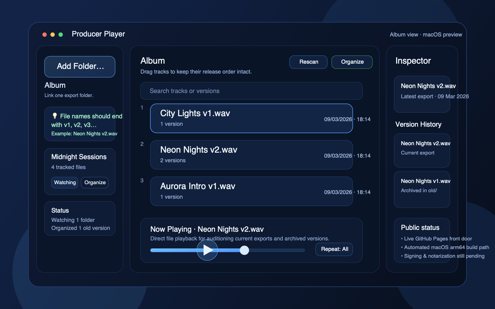

# Producer Player

Producer Player is a desktop app for producers who export the same songs repeatedly and need one clean place to keep track of versions, audition older takes, and preserve album order.



## Public links

- Live page: <https://ethansk.github.io/producer-player/>
- Repository: <https://github.com/EthanSK/producer-player>
- Releases: <https://github.com/EthanSK/producer-player/releases>
- Desktop build workflow: <https://github.com/EthanSK/producer-player/actions/workflows/release-desktop.yml>
- Security policy: [`SECURITY.md`](SECURITY.md)

## What it does

- Groups repeated exports into one logical song entry
- Keeps track order stable while versions change over time
- Surfaces archived versions in history instead of losing them
- Lets you audition current and older exports quickly

## Public readiness right now

What is true today:

- The GitHub Pages landing page is live.
- The repository is public.
- The desktop build path is wired up.
- Local verification on Apple Silicon produces a macOS ZIP build (`Producer-Player-0.1.0-mac-arm64.zip`).

What is **not** being claimed yet:

- A signed macOS release
- Apple notarization
- A polished launch-ready public download channel

That means the project is publicly visible and buildable, but it should **not** be presented as a finished signed macOS launch release yet.

## Downloads

The intended public download surface is the GitHub Releases page:

- <https://github.com/EthanSK/producer-player/releases>

Until signing and notarization are in place, any macOS ZIP build should be treated as a test build.
If you open an unsigned macOS build, Gatekeeper friction is expected.

## Local development

```bash
npm install
npm run dev
```

### Build

```bash
npm run build
```

### Typecheck

```bash
npm run typecheck
```

### End-to-end tests

```bash
npm run e2e
npm run e2e:ci
```

### Local desktop packages

```bash
npm run release:desktop:mac
npm run release:desktop:linux
npm run release:desktop:win
```

## Repo layout

- `apps/electron` — Electron main process and preload bridge
- `apps/renderer` — React renderer UI
- `packages/contracts` — shared IPC/types
- `packages/domain` — folder scanning, grouping, and ordering logic
- `apps/e2e` — Playwright desktop tests
- `site/` — GitHub Pages landing page

## Security and repo hygiene

This repo now includes:

- [`SECURITY.md`](SECURITY.md) for vulnerability reporting guidance
- Dependabot configuration for npm and GitHub Actions updates
- A CodeQL workflow for automated code scanning

## License status

No open-source license has been chosen yet.
Until a license is added, the repository should be treated as **all rights reserved by default**.
See [`docs/LICENSE_STATUS.md`](docs/LICENSE_STATUS.md).

## Archived Swift prototype

An older Swift prototype is still kept in `old-swift-project/` as historical archive material, but the public-facing app direction is the current Electron + TypeScript implementation.
