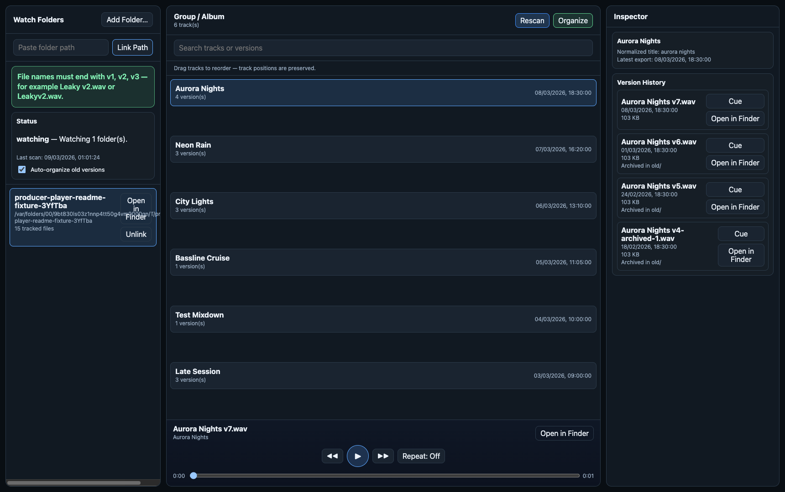

# Producer Player

Producer Player currently has **two implementations in the same repo**:

1. **Swift MVP (existing, kept intact)** for current macOS testing
2. **Electron + TypeScript vertical slice (new)** for cross-platform direction

The Swift app remains available and untouched for MVP validation while cross-platform packaging is built out.

---

## Repository

- <https://github.com/EthanSK/producer-player>

---

## Download prebuilt app (no local build required)

### Available now

Unsigned desktop ZIP artifacts (macOS, Linux, Windows) are produced by:

- Workflow file: [`.github/workflows/release-desktop.yml`](.github/workflows/release-desktop.yml)
- Workflow page: <https://github.com/EthanSK/producer-player/actions/workflows/release-desktop.yml>

Artifacts:

- `Producer-Player-<version>-mac-<arch>.zip`
- `Producer-Player-<version>-linux-<arch>.zip`
- `Producer-Player-<version>-win-<arch>.zip`
- matching checksum files: `*.zip.sha256`

Current workflow default builds for the GitHub Actions runner architecture for each OS.

Download sources:

1. **Workflow artifacts** (main/master pushes + manual dispatch)
2. **GitHub Releases assets** on `v*` tags:
   - <https://github.com/EthanSK/producer-player/releases>

> These builds are intentionally unsigned for immediate testability.
> On first launch, macOS Gatekeeper may require right-click → **Open**.

### Planned (not yet enabled)

- Signed/notarized macOS DMG
- Signed Windows installer (NSIS/MSIX)
- Linux packages (AppImage/deb)

See [`docs/RELEASING.md`](docs/RELEASING.md) for roadmap and exact signing secret names.

---

## Demo video

- In-repo demo clip: [`site/assets/demo/producer-player-demo.mp4`](site/assets/demo/producer-player-demo.mp4)
- Expected Pages-hosted demo path (after successful Pages deploy):
  - <https://ethansk.github.io/producer-player/assets/demo/producer-player-demo.mp4>

---

## GitHub Pages landing page

A polished static landing page is included in:

- `site/index.html`
- `site/styles.css`
- `site/assets/**`

Workflow:

- `.github/workflows/pages.yml`

Expected Pages URL:

- <https://ethansk.github.io/producer-player/>

---

## GitHub Actions workflows

- **CI checks/build:** `.github/workflows/ci.yml`
  - Node workspace install + typecheck + build
  - Swift MVP build on macOS
- **GitHub Pages deploy:** `.github/workflows/pages.yml`
  - Uploads `site/` as Pages artifact and deploys
- **Desktop prebuilt releases:** `.github/workflows/release-desktop.yml`
  - Builds unsigned desktop ZIP artifacts (macOS, Linux, Windows)
  - Uploads ZIP + checksum artifacts
  - On `v*` tags, attaches assets to GitHub Releases

---

## Release notes + changelog process

- Changelog: [`CHANGELOG.md`](CHANGELOG.md)
- Release notes template: [`.github/RELEASE_NOTES_TEMPLATE.md`](.github/RELEASE_NOTES_TEMPLATE.md)
- Release notes categories (optional): [`.github/release.yml`](.github/release.yml)
- First-release instructions + signing guidance: [`docs/RELEASING.md`](docs/RELEASING.md)

---

## 1) Swift MVP (existing)

SwiftUI + AVFoundation + SQLite implementation for producer re-render workflows.

### Run

```bash
cd /Users/ethansk/Projects/producer-player
swift build
swift run ProducerPlayer
```

---

## 2) Electron + TypeScript (cross-platform workstream)

Monorepo-ish workspace with typed boundaries:

- `apps/electron` → Electron main + preload process
- `apps/renderer` → React + Vite desktop UI
- `packages/contracts` → shared types + IPC contracts
- `packages/domain` → folder scan/watch + logical song model skeleton
- `apps/e2e` → Playwright E2E tests for desktop shell happy path

### What the current vertical slice includes

- Folder linking (dialog + direct path input)
- Folder watch + auto refresh on export changes
- Logical song grouping skeleton (normalization + versions)
- Tri-panel UI direction:
  - left: watch folders + song shortcuts
  - middle: library list with search and songs/versions toggle
  - right: inspector with version history + status
- Typed IPC bridge and shared contracts package

### App snapshot (test files + archived versions)



This screenshot shows a realistic test fixture with multiple tracks in the library list (center panel) and older exports archived under `old/` in the inspector version history (right panel).

### Run (Electron dev)

```bash
cd /Users/ethansk/Projects/producer-player
npm install
npm run dev
```

### Build

```bash
npm run build
```

### Build prebuilt desktop ZIP locally

```bash
npm run release:desktop:mac
npm run release:desktop:linux
npm run release:desktop:win
```

### Typecheck

```bash
npm run typecheck
```

### E2E

```bash
npm run e2e
npm run e2e:ci
```

---

## Architecture + migration docs

- [`docs/ARCHITECTURE.md`](docs/ARCHITECTURE.md)
- [`docs/CROSS_PLATFORM_MIGRATION.md`](docs/CROSS_PLATFORM_MIGRATION.md)
- [`docs/E2E.md`](docs/E2E.md)
- [`docs/PUBLIC_STATUS.md`](docs/PUBLIC_STATUS.md)
- [`docs/RELEASING.md`](docs/RELEASING.md)
