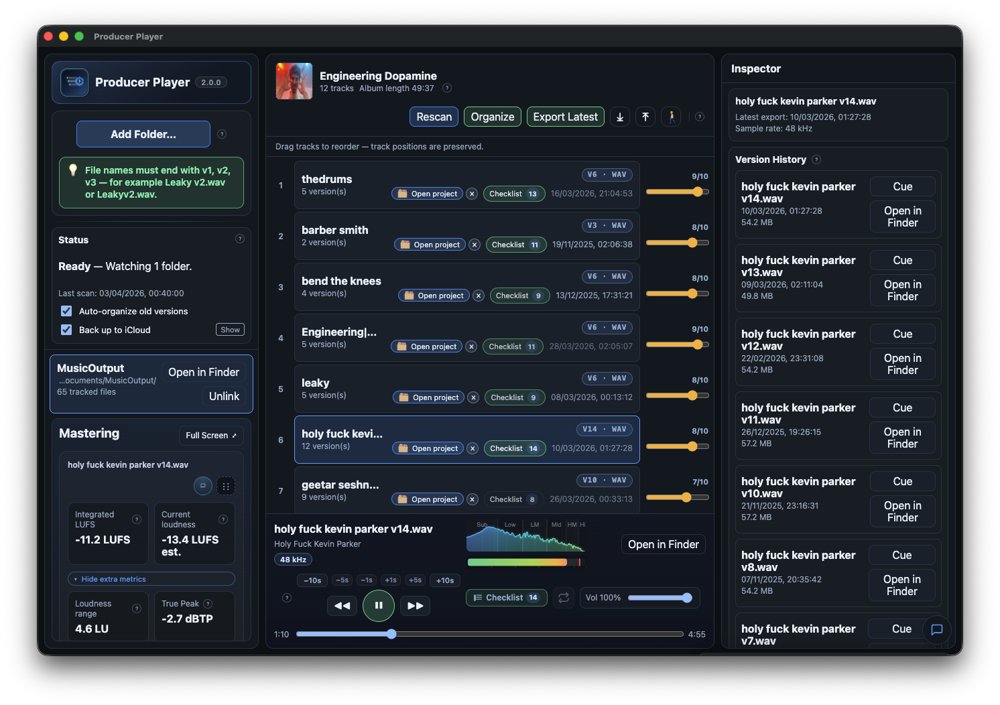
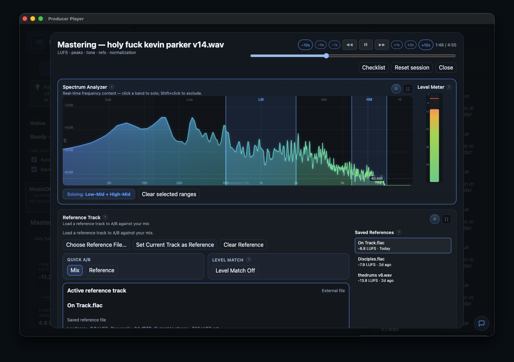
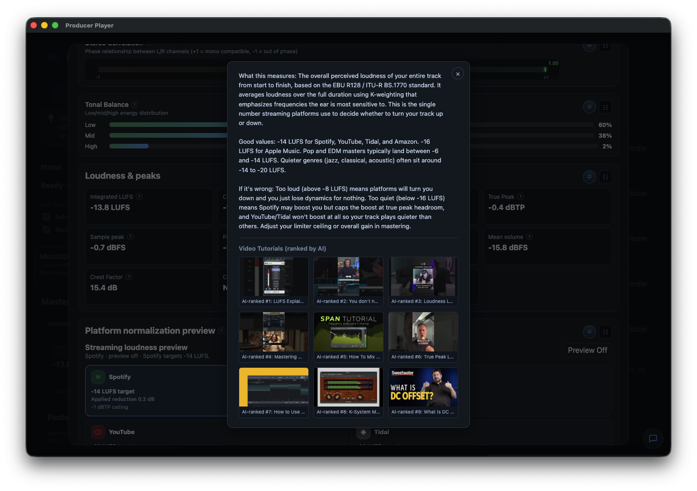
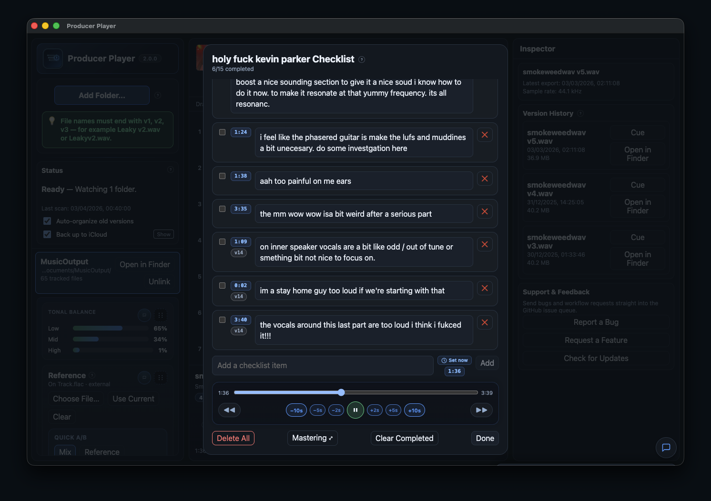
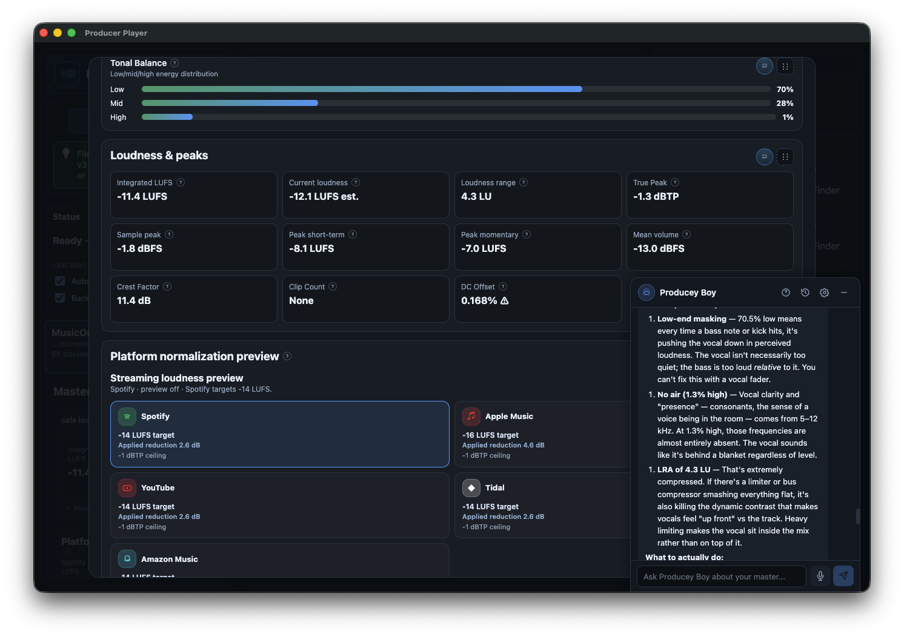
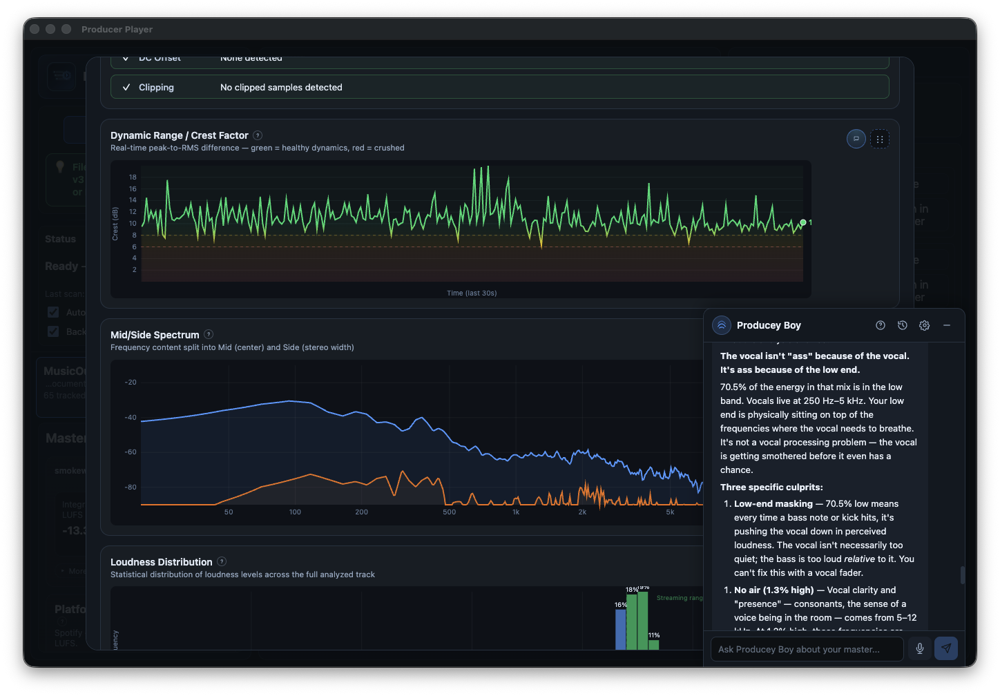
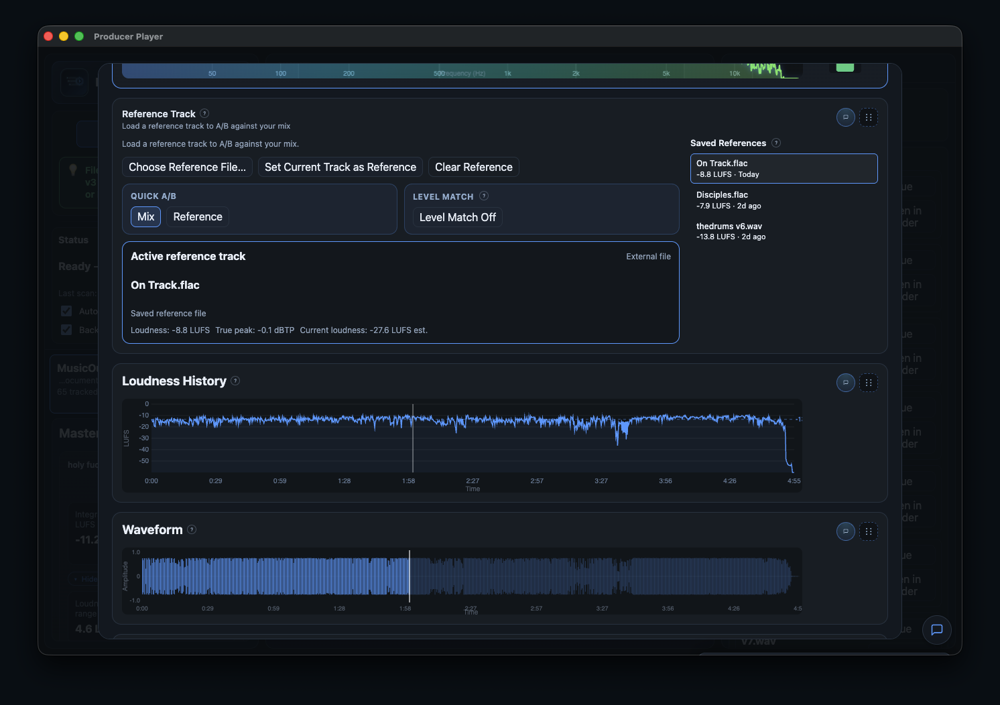

**Website: https://ethansk.github.io/producer-player/**

---

[](https://github.com/EthanSK/producer-player/actions/workflows/ci.yml)
[](https://github.com/EthanSK/producer-player/actions/workflows/release-desktop.yml)
[](LICENSE)

# Producer Player

**A free, source-available mastering analysis suite and production companion for music producers and mastering engineers.**

Stop paying for expensive metering plugins. Producer Player gives you broadcast-grade loudness metering, stereo imaging analysis, platform normalization preview, reference A/B comparison, and version tracking -- all in one app.

<p align="center">
  
</p>

<table>
  <tr>
    <td align="center" width="50%">
      <br />
      <strong>Mastering Workflow</strong><br />
      <sub>Full-screen spectrum analyzer with frequency band soloing, level meter, and reference track A/B comparison.</sub>
    </td>
    <td align="center" width="50%">
      <br />
      <strong>Built-in Tutorials</strong><br />
      <sub>Every metric explained in plain language with curated video tutorials. Plus an AI mastering assistant you can chat with for personalised guidance.</sub>
    </td>
  </tr>
  <tr>
    <td align="center" width="50%">
      <br />
      <strong>Production Checklist</strong><br />
      <sub>Per-song notes with timestamps and version management. Built-in transport controls for quick review.</sub>
    </td>
    <td align="center" width="50%">
      <br />
      <strong>Platform Normalization</strong><br />
      <sub>Tonal balance, loudness &amp; peak metrics, streaming platform targets. AI mastering assistant with detailed analysis.</sub>
    </td>
  </tr>
  <tr>
    <td align="center" width="50%">
      <br />
      <strong>Advanced Analysis</strong><br />
      <sub>Dynamic range, crest factor, mid/side spectrum, and loudness distribution. AI-powered frequency and stereo field analysis.</sub>
    </td>
    <td align="center" width="50%">
      <br />
      <strong>Reference Matching</strong><br />
      <sub>A/B compare against reference tracks with loudness history and waveform visualization.</sub>
    </td>
  </tr>
</table>

## Mastering Analysis Suite

Everything you need to evaluate and polish your masters, completely free.

### Loudness Metering

- **Integrated LUFS** -- The standard measurement for streaming platforms and broadcast compliance.
- **Short-term LUFS** -- 3-second window for tracking dynamic changes during a track.
- **Momentary LUFS** -- 400ms window for catching transient peaks and loud passages.
- **Loudness Range (LRA)** -- Quantifies the dynamic range of your master.
- **Loudness History Graph** -- Visualize loudness over the full duration of your track.

### Peak Analysis

- **True Peak (dBTP)** -- Inter-sample peak detection to prevent clipping on D/A conversion.
- **Sample Peak** -- Per-sample peak level for quick headroom checks.
- **Clip Count** -- Instantly see how many clipped samples exist in your bounce.
- **Crest Factor** -- Peak-to-RMS ratio showing how much headroom your transients use.
- **DC Offset** -- Detect unwanted DC bias that wastes headroom.

### Stereo Imaging

- **Vectorscope** -- Real-time Lissajous display of your stereo field.
- **Stereo Correlation Meter** -- Verify mono compatibility at a glance. Catch phase issues before they ruin your mix on club systems and phone speakers.

### Spectral Analysis

- **Spectrum Analyzer** -- Full-spectrum frequency display.
- **Band Soloing** -- Isolate frequency bands to hear exactly what's happening in each range.

### Platform Normalization Preview

Hear exactly what the streaming platforms will do to your master before you upload:

- **Spotify** (-14 LUFS)
- **Apple Music** (-16 LUFS)
- **YouTube** (-14 LUFS)
- **TIDAL** (-14 LUFS)
- **Amazon Music** (-14 LUFS)

Headroom-aware gain limits ensure the preview is accurate -- if the platform would clip your track, you'll hear it.

### Reference A/B Comparison

- Load a reference track alongside your master.
- **Automatic level matching** so you're comparing tone, not volume.
- Playhead restore after reference auditioning -- switch back and pick up exactly where you left off.

### Monitoring Tools

- **Mid/Side Monitoring** -- Solo the mid or side signal to evaluate stereo width and center content independently.
- **K-Metering (K-14, K-20)** -- Bob Katz's K-System metering for calibrated monitoring at different target levels.

## Production Features

### Version Tracking

Drag in a folder of bounces and Producer Player groups versions automatically (`Track v1`, `Track v2`, etc.), with archive-aware handling for older exports. Never lose track of which bounce is which.

### Album Ordering

Drag and reorder songs into your album sequence. Order persists through rescans, restarts, and relink flows.

### Checklists & Ratings

- Per-song checklist workflow to track your mix/master to-do items.
- 1-10 rating slider to annotate and evaluate tracks.
- **Time-stamped checklist notes** -- add a checklist item and it captures the exact playback position. Click the timestamp to jump right back.

### Export Latest

Exports the latest version of every song as numbered, album-sequenced files with ordering JSON for handoff.

### Playback Controls

Play/pause, next/previous, repeat, scrub, and volume with per-song playhead continuity.

## Tech Stack

| Layer | Tech |
|-------|------|
| Desktop shell | Electron 40 |
| Renderer | React + TypeScript |
| Build tooling | Vite, electron-builder |
| Testing | Playwright (E2E) |
| CI/CD | GitHub Actions |

Monorepo with npm workspaces:

```
apps/electron    -- main process + preload bridge
apps/renderer    -- React UI
apps/e2e         -- Playwright desktop tests
packages/contracts -- shared IPC types
packages/domain  -- folder scanning, grouping, ordering logic
site/            -- GitHub Pages landing page
```

## Getting Started

```bash
# Install dependencies
npm install

# Run in development mode (stable, no hot reload)
npm run dev

# Run with renderer hot reload explicitly enabled
npm run dev:hot
```

## Build & Validate

```bash
npm run build            # full production build
npm run typecheck        # full typecheck (all workspaces)

npm run validate:quick   # default local pass: app typecheck + smoke E2E
npm run validate:core    # broader local pass: app typecheck + core E2E
npm run validate:full    # release-confidence pass: full typecheck + full E2E

npm run e2e              # lean default (same behavior as e2e:smoke)
npm run e2e:smoke        # build + smoke tests (@smoke)
npm run e2e:core         # build + core E2E specs
npm run e2e:full         # build + full E2E suite (previous e2e:ci behavior)
```

## Version Bump Policy (Pre-push + CI)

Release-relevant changes must include a semantic version bump in `package.json`, with a **minimum of patch** (`x.y.z -> x.y.(z+1)`) when a bump is required.

- Local enforcement: Git `pre-push` hook runs `npm run version:bump:check`
- CI enforcement: `.github/workflows/ci.yml` runs the same check on PRs and pushes
- No auto-bumping or auto-commit behavior is used (checks only), so there is no self-triggering loop risk

After cloning, run `npm install` once to set up hooks automatically (`prepare` -> `npm run hooks:install`).
If needed, reinstall manually:

```bash
npm run hooks:install
```

To satisfy the check on release-relevant changes:

```bash
npm run version:bump:patch   # default path
# or
npm run version:bump:minor
```

## Desktop Packaging

```bash
npm run build:mac              # macOS ZIP
npm run build:mac:dir          # macOS unpacked
npm run build:mac:mas-dev      # Mac App Store (dev)
npm run build:mac:mas          # Mac App Store (distribution)
npm run build:mac:mas:local    # MAS build with default profile/env override
npm run mas:preflight          # full submission preflight (includes upload tooling)
npm run mas:preflight:build    # build-only preflight (upload tooling is warning-level)
npm run mas:screenshots        # Generate ASC screenshot pack
npm run mas:upload             # Upload latest MAS .pkg via iTMSTransporter
npm run release:desktop:linux  # Linux ZIP
npm run release:desktop:win    # Windows ZIP
```

See [docs/RELEASING.md](docs/RELEASING.md), [docs/MAC_APP_STORE.md](docs/MAC_APP_STORE.md), and [docs/APP_STORE_CONNECT_CHECKLIST.md](docs/APP_STORE_CONNECT_CHECKLIST.md) for packaging/submission details.

## Downloads

Release versioning now uses a single source of truth for semantic versioning: `package.json`.

Pushes to `main`/`master` also embed automatic build metadata into the app version display (`<semver>+build.<run_number>.<sha>`), so each push advances the visible in-app version without requiring a manual semver edit.

Pushes to `main`/`master` publish macOS, Linux, and Windows ZIP builds plus SHA-256 checksums under:

- `v<package-version>` for the first release of that app version
- `v<package-version>-build.<run_number>` for additional builds of the same app version

> Current builds are unsigned preview releases. Signed/notarized macOS distribution and Mac App Store submission are pending.

**-> [Latest release](https://github.com/EthanSK/producer-player/releases)**

## Links

- [Website](https://ethansk.github.io/producer-player/)
- [Repository](https://github.com/EthanSK/producer-player)
- [Releases](https://github.com/EthanSK/producer-player/releases)
- [Security Policy](SECURITY.md)

## License

PolyForm Noncommercial 1.0.0 -- see [LICENSE](LICENSE).

Commercial use (including selling this software) is not permitted under this license without a separate commercial agreement.
